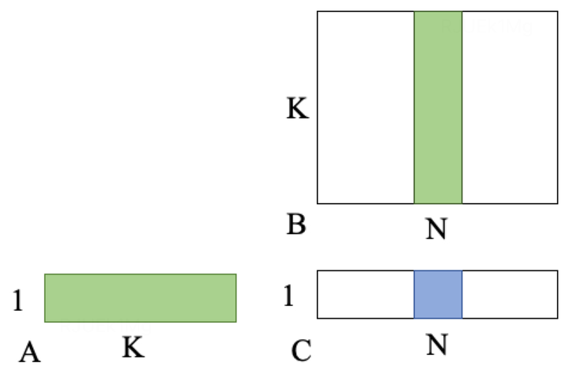
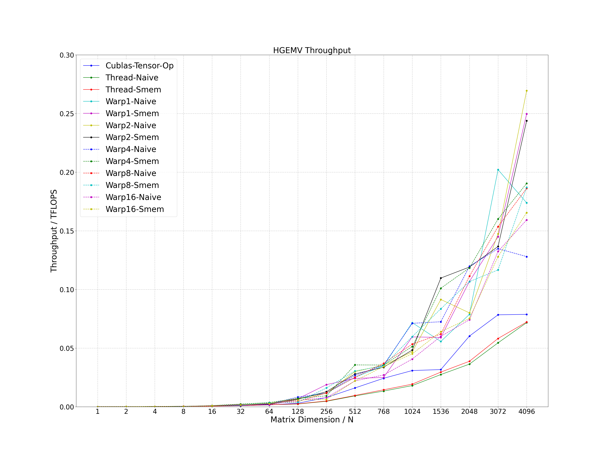

# CUDA HGEMV
Several optimization methods of half-precision general matrix vector multiplication (HGEMV) using CUDA core. The calculation expression is as follows, where the precision of matrix A (1 * K), B (K * N) and C (1 * N) is FP16. Through exploring various parallel task design, the current performance between 1 to 4096 dimensions is not less than 150% of the performance of cublas.
```
C (1 * N) = A (1 * K) * B (K * N)
```



# Optimization Method
- Thread Naive: each thread computes 1 result of C
- Thread Smem: each thread computes 1 result of C using shared memory
- Warp1 Naive: each warp computes 1 result of C
- Warp1 Smem: each warp computes 1 result of C using shared memory
- Warp2 Naive: each warp computes 2 results of C
- Warp2 Smem: each warp computes 2 results of C using shared memory
- Warp4 Naive: each warp computes 4 results of C
- Warp4 Smem: each warp computes 4 results of C using shared memory
- Warp8 Naive: each warp computes 8 results of C
- Warp8 Smem: each warp computes 8 results of C using shared memory
- Warp16 Naive: each warp computes 16 results of C
- Warp16 Smem: each warp computes 16 results of C using shared memory

# Compile
## Environment
- OS: Linux
- Cmake Version: >= 3.12
- GCC Version: >= 4.8
- CUDA Version: >= 11.0
- Others: gflags, ccache
```
sudo apt-get install libgflags-dev ccache
```

## Clone
```
git clone https://github.com/Bruce-Lee-LY/cuda_hgemv.git
```

## Build
### NVIDIA A100
```
cd cuda_hgemv
./build.sh -a 80 -t Release -b OFF
./build.sh -a 80 -t Debug -b OFF
```

### RTX3080Ti / RTX3090 / RTX A6000
```
cd cuda_hgemv
./build.sh -a 86 -t Release -b OFF
./build.sh -a 86 -t Debug -b OFF
```

# Run Sample
```
./run_sample.sh
```

# Performance
Process the data in the log and plot it as a line chart.

```
cd tools/performance
./performance.sh
```

## RTX3090
- CUDA Version: 11.8
- K: 128

Performance achieved by current optimization methods.


